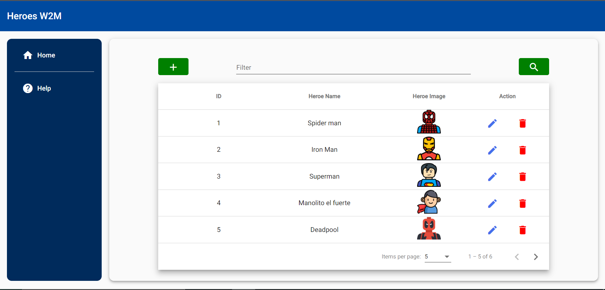

# W2mFront

This project was generated with [Angular CLI](https://github.com/angular/angular-cli) version 12.2.5.



## Instalation

```bash
npm install
```

## Development server

Run `ng serve` for a dev server. Navigate to `http://localhost:4200/`. The app will automatically reload if you change any of the source files.

## Deveploment Backend server

If you are running the project locally execute the next command to have a complete backend with json server: 

```bash
#run json server
npm run backend
```

## Build

Run `ng build` to build the project. The build artifacts will be stored in the `dist/` directory.

## Running unit tests

Run `ng test` to execute the unit tests via [Karma](https://karma-runner.github.io).

## Build Docker Image
```bash
# Build the image
docker build -t w2m-front .
```

## Check Docker Image
```bash
# Check the image
docker image ls
```

## Run Docker Image
```bash
# Check the image
docker run -d -it -p 8080:80 w2m-front
```
After run the docker image you have to go to http://localhost:8080

## Contributing
Pull requests are welcome. For major changes, please open an issue first to discuss what you would like to change.

Please make sure to update tests as appropriate.

## License
VManuelPM


